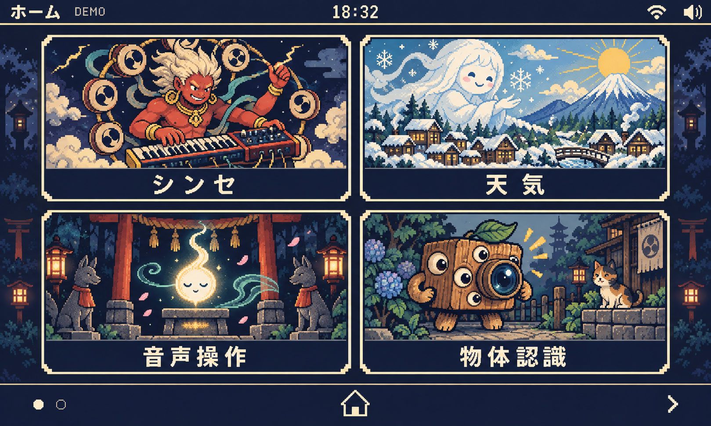

# Yokai OS — ESP32-S31 Full-Function HMI Demo

An 800×480 touch HMI demo for **ESP32-S31-Korvo-1**, built with ESP-IDF, LVGL 9, ESP-SR, ESP-DL, Wi-Fi, Bluetooth audio, camera/Vision AI, and a Japanese `Yokai OS` visual theme.

> **Active development branch:** `codex/vision-ai`  
> **Target board:** ESP32-S31-Korvo-1  
> **UI language:** Japanese  
> **ESP-IDF:** 6.2.0 development baseline used by the current hardware validation  
> **Flash / PSRAM:** 16 MB / 16 MB Octal  
> **LCD:** 800×480 RGB  
> **Camera:** SC101IOT, DVP, 1280×720 UYVY



---

## Project status

The project has moved beyond a static UI prototype and now runs the main services on real hardware.

| App / subsystem | Status | Current implementation |
| --- | --- | --- |
| Home / Shell | ✅ Hardware verified | 2-page TileView launcher, 95 ms screen transition, global quick settings |
| Synth | ✅ Implemented | Polyphonic synth, waveform presets, cutoff / resonance, oscilloscope, ES8311 output |
| Weather | ✅ Implemented | Wi-Fi, SNTP, Open-Meteo, dynamic weather background, Lottie effects |
| Voice Shrine | ✅ Implemented | ESP-SR AFE/AEC, WakeNet, MultiNet, Japanese + English offline commands |
| Vision AI | ✅ Face pipeline implemented | DVP camera preview, face detection, MobileFaceNet recognition, 5-sample enrollment, persistent face DB |
| Object recognition | ⏸ Paused | Intentionally not part of the current completion gate |
| Wi-Fi | ✅ Implemented | Scan, password entry, saved STA config, connection/error feedback |
| Bluetooth audio | ✅ Implemented | Classic BT / A2DP sink and shared audio output |
| Fireworks | ✅ Production (Style B) | Torii & lake procedural art, custom LVGL layer draw callback, fixed pool (160 particles, 4 rockets), 3 styles (菊/牡丹/柳), manual tap + auto fireworks, zero per-frame malloc |
| Clock / Timer | ✅ Production (Style B) | Torii & lake twilight procedural art, SNTP-backed clock, `esp_timer_get_time()` monotonic deadline countdown, stopwatch with 8 rolling laps |
| Calculator | ✅ Production (Style A) | Dark lacquer & gold procedural bezel, AC/C, +/-, %, 4 basic operations, decimal handling, chained evaluation, operator replacement, repeated equals, divide-by-zero protection, max 8-record rolling history |
| Food freshness | 🟡 Prototype | UI/demo state; persistence/editing remains future work |

Detailed hardware verification data and telemetry: [YOKAI_3APPS_PRODUCTION_VERIFICATION_2026-09-24.md](docs/YOKAI_3APPS_PRODUCTION_VERIFICATION_2026-09-24.md).

---

## Hardware

Current reference platform:

| Item | Configuration |
| --- | --- |
| Board | ESP32-S31-Korvo-1 |
| Flash | 16 MB Octal |
| PSRAM | 16 MB Octal |
| LCD | 800×480 RGB |
| Touch | GT1151 |
| Audio codec | ES8311 |
| Camera | SC101IOT |
| Camera format | 1280×720 UYVY |
| Camera buffers | 2 V4L2 MMAP buffers |
| LCD frame buffers | 2 full RGB565 frame buffers |
| Vision preview | 3 × 320×240 RGB565 buffers |

---

## Architecture

```text
app_main
├── storage / NVS
├── synth_service
├── voice_service
├── weather_service
├── vision_service
│   └── vision_camera
└── board_ui
    └── LVGL 9
        ├── Home / Drawer
        ├── Synth
        ├── Weather
        ├── Wi-Fi / Bluetooth
        └── Apps
            ├── Voice
            ├── Vision
            ├── Fireworks
            ├── Clock / Timer
            ├── Calculator
            └── Food
```

The UI screens are created once and kept resident. Heavy runtime services are controlled independently from screen routing. Vision capture/inference is started when entering the Vision screen and stopped when leaving it.

---

## Vision AI

The face-recognition path is the most heavily validated part of the project.

Implemented features include:

- SC101IOT 1280×720 UYVY DVP camera capture.
- 320×240 RGB565 live preview.
- Three-buffer preview ownership model for display / ready / inference.
- ESP-DL human face detection.
- MobileFaceNet-based recognition.
- 5-sample guided enrollment.
- Pose/stability gating and user-visible error codes.
- Persistent face database + metadata.
- Interrupted-enrollment rollback/recovery.
- Face management: enroll, delete, re-register, clear.
- Continuous health telemetry for UI, capture, inference and heap state.

Detailed documents:

- [Vision enrollment UX & reliability — 2026-09-24](docs/VISION_ENROLLMENT_UX_RELIABILITY_2026-09-24.md)
- [Vision AI stability handoff — 2026-09-22](docs/VISION_AI_STABILITY_2026-09-22.md)
- [Agent handoff](docs/AGENT-HANDOFF.md)

### Important memory note

Do **not** interpret the HOME-screen free-PSRAM number as the Vision peak headroom.

The validated memory history shows roughly:

| Stage | Representative free PSRAM |
| --- | ---: |
| HOME before first Vision entry | ~5.25 MB |
| After camera MMAP allocation | ~1.56 MB |
| After first detector run | ~1.25 MB |
| After first MFN feature operation | ~0.33–0.34 MB |

The first MFN feature operation was observed to consume about **916 KB** of PSRAM. In a long Vision run with MFN loaded, internal SRAM was about **71 KB free**, with an observed historical minimum below that.

Therefore new apps must avoid large new persistent PSRAM allocations. Prefer:

- compressed assets stored in Flash;
- one shared reusable decoded background buffer;
- fixed-size particle/state pools;
- LVGL primitives/custom drawing instead of full-screen canvases;
- bounded queues and bounded history buffers.

---

## Display and image memory

Current display configuration:

- `CONFIG_BSP_LCD_RGB_BUFFER_NUMS=2`
- LVGL adapter: `DOUBLE_FULL`
- 800×480 RGB565

Current background strategy already saves PSRAM by keeping weather variants compressed in Flash and reusing one decoded weather buffer.

When adding new themed screens, **do not allocate one 800×480 RGB565 buffer per app**. One such buffer is about **750 KiB**. Fireworks, Clock and Calculator should reuse a common scene/background buffer or use procedural UI.

---

## Build

Project directory:

```text
firmware/korvo1_yokai_demo
```

Activate the ESP-IDF environment used by the project:

```bash
source /Users/kongweilu/esp/esp-idf-master/export.sh
cd "firmware/korvo1_yokai_demo"
```

Configure/build:

```bash
idf.py set-target esp32s31
idf.py build
```

The project applies required managed-component patches from:

```text
firmware/korvo1_yokai_demo/tools/apply_managed_component_patches.py
```

The patch script is intentionally strict: if an upstream managed component no longer matches the expected source, configuration should fail instead of silently applying an unsafe patch.

---

## Flash

The project hardware workflow uses:

- serial port: `/dev/cu.usbserial-1120`
- flashing baud rate: **920160**

```bash
idf.py -p /dev/cu.usbserial-1120 -b 920160 flash
```

Monitor:

```bash
idf.py -p /dev/cu.usbserial-1120 monitor
```

For regression work, keep the flash baud rate at **920160** unless there is a hardware/transport reason to change it.

---

## Test / validation entry points

Host-side checks live under:

```text
firmware/korvo1_yokai_demo/test/
```

Notable checks include:

- `test_vision_service.c`
- `test_ui_regression.py`
- `test_voice_service.c`
- `test_weather_service.c`
- `test_synth_math.c`

Before accepting changes to display/Vision code, also run:

```bash
python3 tools/apply_managed_component_patches.py --project-root . --check
idf.py build
```

Hardware acceptance should additionally verify:

- repeated HOME ↔ app transitions;
- no WDT/reset;
- no `DISPLAY_STALL`;
- no camera `esp_cache_msync` abort;
- stable task count after returning HOME;
- stable free/largest heap values;
- touch responsiveness;
- audio/voice service still functioning while other apps are exercised.

---

## Current reliability constraints

These are known engineering constraints, not necessarily active failures:

1. **PSRAM peak headroom is tight after camera + detector + MFN are resident.** New full-screen persistent buffers are not acceptable.
2. **Camera MMAP buffers are intentionally retained after STREAMOFF.** Previous deinit/restart experiments recovered memory but made later full-resolution camera allocation unreliable.
3. **The face detector/recognizer objects are retained once loaded.** This improves re-entry stability but keeps memory committed.
4. **Managed components currently require local source patches.** Dependency upgrades must be treated as a controlled migration.
5. **Object detection is paused.** Do not add another model until the memory budget is re-measured and a separate acceptance gate is defined.

---

## Source map

```text
firmware/korvo1_yokai_demo/
├── sdkconfig.defaults
├── partitions.csv
├── tools/
│   └── apply_managed_component_patches.py
├── test/
└── main/
    ├── app_main.c
    ├── board_ui.c
    ├── synth_service.c
    ├── voice_service.c
    ├── weather_service.c
    ├── vision_camera.c
    ├── vision_service.cpp
    └── ui/
        ├── ui.c
        ├── ui_theme.c
        ├── ui_home.c
        ├── ui_drawer.c
        ├── ui_synth.c
        ├── ui_weather.c
        ├── ui_wifi.c
        ├── ui_bluetooth.c
        ├── ui_apps.c
        └── ui_image_loader.c
```

---

## Design

The UI direction is a dark Japanese folklore / Showa handheld theme with gold, vermilion and cyan accents.

Design references and historical concept images are under:

- [design/yokai-v1/DESIGN.md](design/yokai-v1/DESIGN.md)
- [design/yokai-v1/APP-SCENES.md](design/yokai-v1/APP-SCENES.md)
- [design/yokai-v1/images](design/yokai-v1/images)

Generated concept art is a **visual reference only**. Text, controls, touch geometry and state feedback in the firmware must remain real LVGL objects rather than baked into a background image.

---

## Next milestones

### Fireworks
Replace the current expanding-circle placeholder with a bounded particle engine, fixed pool allocation, touch/drag launch behavior, multiple burst styles and optional sound feedback.

### Clock / Timer
Add accurate SNTP/local-time presentation, configurable timer presets, pause/resume/reset, deadline-based countdown, stopwatch and completion audio/visual feedback.

### Calculator
Replace the current two-operand state machine with iPhone-style chained-operation semantics, `AC/C`, sign, percent, robust formatting, divide-by-zero handling and bounded history.

### Later
After the three low-memory apps are stable, reassess:

- Matter / smart-home dashboard;
- local voice + cloud/LLM assistant;
- sensor dashboard;
- camera QR/barcode workflow;
- device provisioning / diagnostics demo;
- multi-board S31/P4/Mosaico profiles.

---

## Development rule for Coding Agents

Before modifying the firmware:

1. Read [docs/AGENT-HANDOFF.md](docs/AGENT-HANDOFF.md).
2. Read the latest Vision reliability documents.
3. Preserve the validated LVGL/display and camera ownership architecture.
4. Treat SRAM/PSRAM as a hard budget.
5. Do not add permanent full-screen buffers without a measured allocation plan.
6. Use **920160 baud** for hardware flashing.
7. Build and run the relevant host tests before hardware acceptance.
8. Do not declare a feature complete from compilation alone; record hardware evidence.
