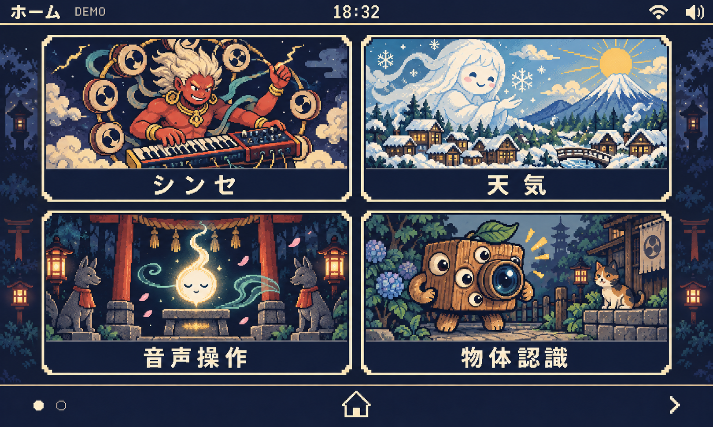

# Yokai OS — ESP32-S31 Full-Function HMI Demo

An 800×480 touch HMI demo for **ESP32-S31-Korvo-1**, built with ESP-IDF, LVGL 9, ESP-SR, ESP-DL, Wi-Fi, Bluetooth audio, camera/Vision AI, and a Japanese `Yokai OS` visual theme.

> **Active development branch:** `codex/vision-ai`  
> **Integration:** [PR #2](https://github.com/weilu-kong/Full-Function-S31-P4-Demo/pull/2), not yet merged into `main`
>
> **Status updated:** 2026-10-01 (JST)
>
> **Target board:** ESP32-S31-Korvo-1  
> **UI language:** Japanese  
> **ESP-IDF:** 6.1, pinned SDK commit `fff9895c82d744c7237be8847347bdd1b07c6643` (preview target)
> **Flash / PSRAM:** 16 MB / 16 MB Octal  
> **LCD:** 800×480 RGB  
> **Camera:** SC101IOT, DVP, 1280×720 UYVY



---

## Project status

The project has moved beyond a static UI prototype and now runs the main services on real hardware.

| App / subsystem | Status | Current implementation |
| --- | --- | --- |
| Home / Shell | ✅ Hardware verified | 2-page TileView launcher, 95 ms screen transition, global quick settings |
| Synth | ✅ Implemented | Polyphonic synth, waveform presets, cutoff / resonance, oscilloscope, ES8389 shared output |
| Weather | ✅ Implemented | Wi-Fi, SNTP, Open-Meteo, stale-data/error feedback, on-demand backgrounds, 8 KiB HTTPS worker stack |
| Voice Shrine | ✅ Implemented | ESP-SR AFE/AEC, WakeNet, MultiNet, Japanese + English offline commands |
| Vision AI | ✅ Face pipeline implemented | 400×300 PPA preview, face detection/recognition, 5-sample enrollment, persistent face DB; startup resource limitation below |
| Object recognition | ⏸ Unavailable | UI identifies it as unsupported; no object model or simulated confidence |
| Wi-Fi | ✅ Implemented | Scan, password entry, saved STA config, connection/error feedback |
| Bluetooth audio | ✅ Implemented | Classic BT / A2DP sink and shared audio output |
| Fireworks | ✅ Production (Style B) | Torii & lake procedural art, custom LVGL layer draw callback, fixed pool (160 particles, 4 rockets), 3 styles (菊/牡丹/柳), manual tap + auto fireworks, zero per-frame malloc |
| Clock / Timer | ✅ Production (Style B) | Torii & lake twilight procedural art, SNTP-backed clock, `esp_timer_get_time()` monotonic deadline countdown, stopwatch with 8 rolling laps |
| Calculator | ✅ Production (Style A) | Dark lacquer & gold procedural bezel, AC/C, +/-, %, 4 basic operations, decimal handling, chained evaluation, operator replacement, repeated equals, divide-by-zero protection, max 8-record rolling history |
| Food freshness | ✅ Bounded implementation | Up to 32 records; add/edit/delete; validated expiry date; CRC-protected two-slot persistence; touch acceptance pending |

### Latest verified state — 2026-10-01

Firmware commit [`96f3aca`](https://github.com/weilu-kong/Full-Function-S31-P4-Demo/commit/96f3aca) is flashed on the reference board using the production configuration. Local firmware build, unified host checks, Flash budget check and flash readback verification passed. The preceding `b456681` [GitHub Actions run](https://github.com/weilu-kong/Full-Function-S31-P4-Demo/actions/runs/36822533159) passed; the CI runs for the inference-stack fix were still in progress at this update.

Two faults were captured and addressed: the Weather HTTPS worker exhausted its former 4 KiB stack, and Vision SIMD preprocessing failed when the inference stack was allocated in RTC RAM. Weather now uses an 8 KiB stack; Vision keeps its 12 KiB stack in DMA-capable internal SRAM, with owner-managed cleanup. Production HTTPS succeeded with 4,044 bytes of stack remaining.

The latest finite 120-second production capture recorded 578 face inferences, approximately 15.58 camera fps and 14.84 displayed preview fps during the stable interval, with no panic, watchdog or display stall. The user confirmed Vision opened after returning Home and retrying. This is a limited verification, not long-duration or mixed audio/voice/Vision acceptance.

**Known startup limitation:** opening Vision while Weather HTTPS is active can fail because regular SRAM is temporarily insufficient for the required inference stack. The failure stops capture safely instead of falling back to RTC RAM. Return Home, allow the weather request to finish, then reopen Vision. Eliminating this startup contention remains pending.

See the [quality and resource report](docs/reports/2026-10-01-quality-resource-improvements.md) for the crash evidence, fixes, measurements and remaining checks.

Detailed hardware verification data and telemetry: [YOKAI_3APPS_PRODUCTION_VERIFICATION_2026-09-24.md](docs/YOKAI_3APPS_PRODUCTION_VERIFICATION_2026-09-24.md).

**2026-09-29 boot fix:** The on-device regression task was accidentally started from `app_main()` in every production boot. It switched through Fireworks, Clock, Calculator, Vision, and Synth after a 9-second delay. The boot call and regression source were removed from the production build. The corrected firmware built and flashed successfully; a 35-second reset log showed the UI staying on Home (`screen=0`) with no regression task, crash, or reboot.

**2026-09-29 Vision enrollment fix:** The shared Clock/Calculator background was decoded eagerly into a 750 KB PSRAM buffer, leaving no contiguous block for MobileFaceNet's 921,600-byte allocation. The background is now loaded on demand and freed before Vision starts. A second-sample crash was traced to two FreeRTOS coprocessor interrupt helpers linked into Flash; `main/linker.lf` places them in IRAM. The rebuilt firmware passed on-device five-sample enrollment, committed the face database, and produced accepted recognition matches without a crash during the serial capture.

---

## Hardware

Current reference platform:

| Item | Configuration |
| --- | --- |
| Board | ESP32-S31-Korvo-1 |
| Flash | 16 MB Octal |
| PSRAM | 16 MB Octal |
| LCD | 800×480 RGB |
| Touch | GT1151 |
| Audio codec | ES8389 |
| Camera | SC101IOT |
| Camera format | 1280×720 UYVY |
| Camera buffers | 2 V4L2 MMAP buffers |
| LCD frame buffers | 2 full RGB565 frame buffers |
| Vision preview | 3 × 320×240 RGB565 buffers |
| Vision display | 400×300 via PPA into the existing LCD draw buffer |

---

## Architecture

```text
app_main
├── storage / NVS
├── synth_service
├── voice_service
├── weather_service
├── vision_service
│   └── vision_camera
└── board_ui
    └── LVGL 9
        ├── Home / Drawer
        ├── Synth
        ├── Weather
        ├── Wi-Fi / Bluetooth
        └── Apps
            ├── Voice
            ├── Vision
            ├── Fireworks
            ├── Clock / Timer
            ├── Calculator
            └── Food
```

Screen shells are kept resident. Food list/editor objects are created on entry and freed on exit; the weather decode buffer is released when leaving Weather. Heavy runtime services are controlled independently from screen routing. Vision capture/inference is started when entering the Vision screen and stopped when leaving it.

---

## Vision AI

The face-recognition path is the most heavily validated part of the project.

Implemented features include:

- SC101IOT 1280×720 UYVY DVP camera capture.
- 320×240 RGB565 pipeline with a 400×300 PPA-scaled display; no additional enlarged preview buffer.
- Three-buffer preview ownership model for display / ready / inference.
- ESP-DL human face detection.
- MobileFaceNet-based recognition.
- 5-sample guided enrollment.
- Pose/stability gating and user-visible error codes.
- Persistent face database + metadata.
- Interrupted-enrollment rollback/recovery.
- Face management: enroll, delete, re-register, clear.
- Continuous health telemetry for UI, capture, inference and heap state.

Detailed documents:

- [Vision enrollment UX & reliability — 2026-09-24](docs/VISION_ENROLLMENT_UX_RELIABILITY_2026-09-24.md)
- [Vision AI stability handoff — 2026-09-22](docs/VISION_AI_STABILITY_2026-09-22.md)
- [Agent handoff](docs/AGENT-HANDOFF.md)

### Important memory note

Do **not** interpret the HOME-screen free-PSRAM number as the Vision peak headroom.

The latest production measurements for firmware `96f3aca` are:

| Measurement | Bytes |
| --- | ---: |
| HOME / UI ready: free PSRAM | 5,964,884 |
| Vision: observed minimum free PSRAM | 1,013,420 |
| Vision: latest largest free PSRAM block | 999,424 |
| Observed minimum free internal heap | 30,580 |
| Inference task: minimum remaining stack | 7,920 |
| Application image | 10,574,336 |
| Application partition reserve | 1,484,288 |

These numbers come from the limited production capture above and do not bound every workload. Weather background release removes a persistent 768,000-byte (750 KiB) PSRAM allocation. Camera + detector + MobileFaceNet still consume most PSRAM; earlier firmware had only about 233 KiB remaining at its measured peak. Internal heap totals include RTC RAM and do not prove a DMA-capable SRAM block is available for the inference stack. Concurrent TLS creates additional transient pressure.

Therefore new apps must avoid large new persistent PSRAM allocations. Prefer:

- compressed assets stored in Flash;
- one shared reusable decoded background buffer;
- fixed-size particle/state pools;
- LVGL primitives/custom drawing instead of full-screen canvases;
- bounded queues and bounded history buffers.

---

## Display and image memory

Current display configuration:

- `CONFIG_BSP_LCD_RGB_BUFFER_NUMS=2`
- LVGL adapter: `DOUBLE_DIRECT`
- 800×480 RGB565

Two Home backgrounds remain resident. Weather variants stay compressed in Flash; one 750 KiB buffer is decoded only while Weather is active and released on exit.

When adding new themed screens, **do not allocate one 800×480 RGB565 buffer per app**. One such buffer is about **750 KiB**. Fireworks, Clock and Calculator should reuse a common scene/background buffer or use procedural UI.

---

## Build

Project directory:

```text
firmware/korvo1_yokai_demo
```

Activate the ESP-IDF environment used by the project:

```bash
source "$IDF_PATH/export.sh" # use the pinned ESP-IDF 6.1 checkout
cd "firmware/korvo1_yokai_demo"
```

Configure/build:

```bash
idf.py --preview -DIDF_TARGET=esp32s31 build
```

The project applies required managed-component patches from:

```text
firmware/korvo1_yokai_demo/tools/apply_managed_component_patches.py
```

The patch script is intentionally strict: if an upstream managed component no longer matches the expected source, configuration should fail instead of silently applying an unsafe patch.

---

## Flash

The project hardware workflow uses:

- serial port: `/dev/cu.usbserial-1120`
- flashing baud rate: **920160**

```bash
idf.py --preview -p /dev/cu.usbserial-1120 -b 920160 flash
```

Monitor:

```bash
idf.py --preview -p /dev/cu.usbserial-1120 monitor
```

For regression work, keep the flash baud rate at **920160** unless there is a hardware/transport reason to change it.

---

## Test / validation entry points

Host-side checks live under:

```text
firmware/korvo1_yokai_demo/test/
```

Notable checks include:

- `test_vision_service.c`
- `test_ui_regression.py`
- `test_voice_service.c`
- `test_weather_service.c`
- `test_synth_math.c`

Before accepting changes to display/Vision code, also run:

```bash
python3 tools/apply_managed_component_patches.py --project-root . --check
idf.py --preview build
```

Hardware acceptance should additionally verify:

- repeated HOME ↔ app transitions;
- no WDT/reset;
- no `DISPLAY_STALL`;
- no camera `esp_cache_msync` abort;
- stable task count after returning HOME;
- stable free/largest heap values;
- touch responsiveness;
- audio/voice service still functioning while other apps are exercised.

---

## Current reliability constraints

Current constraints and remaining validation:

1. **PSRAM peak headroom is tight after camera + detector + MFN are resident.** New full-screen persistent buffers are not acceptable.
2. **Camera MMAP buffers are intentionally retained after STREAMOFF.** Previous deinit/restart experiments recovered memory but made later full-resolution camera allocation unreliable.
3. **Vision startup can fail during concurrent Weather HTTPS.** The inference stack requires regular DMA-capable internal SRAM; returning Home and retrying after HTTPS completes currently recovers. Detector/recognizer objects are deleted after inference exits on a successful stop; camera MMAP buffers remain retained.
4. **Managed components currently require local source patches.** Dependency upgrades must be treated as a controlled migration.
5. **Object detection is paused.** Do not add another model until the memory budget is re-measured and a separate acceptance gate is defined.
6. **Vision CPU and mixed-load headroom are not yet verified.** Production runtime statistics are disabled; the LVGL sysmon `CPU 100%` value is not a valid capacity measurement. Use bounded diagnostic captures, then restore production.

---

## Source map

```text
firmware/korvo1_yokai_demo/
├── sdkconfig.defaults
├── partitions.csv
├── tools/
│   ├── apply_managed_component_patches.py
│   └── check_firmware_size.py
├── test/
└── main/
    ├── app_main.c
    ├── board_ui.c
    ├── synth_service.c
    ├── voice_service.c
    ├── weather_service.c
    ├── food_service.c
    ├── app_health.c
    ├── vision_camera.c
    ├── vision_service.cpp
    └── ui/
        ├── ui.c
        ├── ui_theme.c
        ├── ui_home.c
        ├── ui_drawer.c
        ├── ui_synth.c
        ├── ui_weather.c
        ├── ui_wifi.c
        ├── ui_bluetooth.c
        ├── ui_apps.c
        ├── ui_food.c
        └── ui_image_loader.c
```

---

## Design

The UI direction is a dark Japanese folklore / Showa handheld theme with gold, vermilion and cyan accents.

Design references and historical concept images are under:

- [design/yokai-v1/DESIGN.md](design/yokai-v1/DESIGN.md)
- [design/yokai-v1/APP-SCENES.md](design/yokai-v1/APP-SCENES.md)
- [design/yokai-v1/images](design/yokai-v1/images)

Generated concept art is a **visual reference only**. Text, controls, touch geometry and state feedback in the firmware must remain real LVGL objects rather than baked into a background image.

---

## Next milestones

Fireworks, Clock / Timer, and Calculator have passed the September 24 hardware regression. Remaining scoped work:

- Resolve first-entry Vision / Weather HTTPS SRAM contention without increasing persistent image memory.
- Verify repeated Vision entry/exit and long-duration operation on the inference-stack fix.
- Complete Food touch/persistence acceptance and mixed A2DP / Voice / Vision checks.
- Measure Vision and mixed-load CPU usage with a bounded diagnostic configuration, then restore production.
- Reassess object recognition only after measuring Vision peak memory and defining a separate hardware acceptance gate.

Possible later extensions:

- Matter / smart-home dashboard;
- local voice + cloud/LLM assistant;
- sensor dashboard;
- camera QR/barcode workflow;
- device provisioning / diagnostics demo;
- multi-board S31/P4/Mosaico profiles.

---

## Development rule for Coding Agents

Before modifying the firmware:

1. Read [docs/AGENT-HANDOFF.md](docs/AGENT-HANDOFF.md).
2. Read the latest Vision reliability documents.
3. Preserve the validated LVGL/display and camera ownership architecture.
4. Treat SRAM/PSRAM as a hard budget.
5. Do not add permanent full-screen buffers without a measured allocation plan.
6. Use **920160 baud** for hardware flashing.
7. Build and run the relevant host tests before hardware acceptance.
8. Do not declare a feature complete from compilation alone; record hardware evidence.


## Quality and resource gates

The unified host entry point exercises engines, lifecycle races, SDK error paths, storage failures, camera DMA preparation, preview ownership, and UI resource release:

```bash
python3 test/run_host_checks.py
python3 tools/check_firmware_size.py build
```

Run these commands from the firmware directory after activating ESP-IDF and resolving managed components. Keep `dependencies.lock` in version control; this quality update retains the previously validated component versions. The Flash gate requires at least **1 MiB free in the application partition** and checks that the speech-model image fits. GitHub Actions builds the pinned SDK and runs the same checks.

Production leaves FreeRTOS runtime statistics disabled. To measure CPU with a separate diagnostic configuration:

```bash
idf.py --preview -B build-diagnostics \
  -DSDKCONFIG=sdkconfig.diagnostics.generated \
  -DSDKCONFIG_DEFAULTS="sdkconfig.defaults;sdkconfig.diagnostics" \
  -DIDF_TARGET=esp32s31 build
```

Use a fresh generated configuration for the overlay. Diagnostics adds a bounded 40-task snapshot to the existing health task, without a new task or heap buffer. Per-task CPU is expressed as a percentage of both cores combined; idle/busy is also logged per core. A baseline sample and new/reset task counters are reported as unknown.

The Food service reserves about **3.8 KiB internal static RAM**, displays six records per page, and allocates its editor only while open. Names are limited to 48 UTF-8 bytes, dates to 2020–2099. Invalid/corrupt storage and failed writes are shown explicitly; the previous valid snapshot is retained. The built-in name keyboard uses Latin input. Expiry status remains unavailable until the clock is synchronized.

Object recognition remains unavailable in the UI. Additional large models and dual-application OTA do not fit the current resource budget without a separate redesign. See the [quality implementation report](docs/reports/2026-10-01-quality-resource-improvements.md) for measured results and remaining hardware checks.
