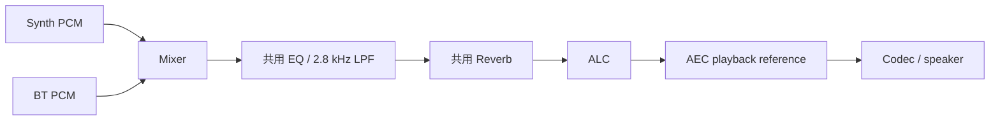
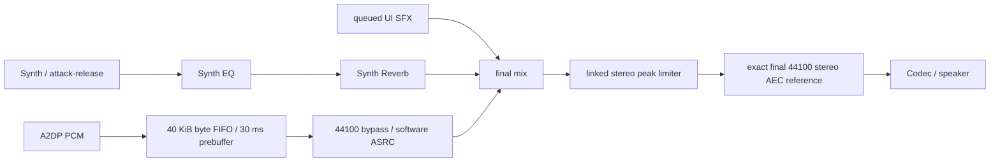

# Synth / A2DP 修复交付记录（2026-09-30，JST）

代码修复、IDF 6.1 构建和实板烧录已完成。**蓝牙掉音尚未通过十分钟实播验收，不能声明已解决。**

## 仓库核对

- 仓库：weilu-kong/Full-Function-S31-P4-Demo。
- 分支：仅 codex/vision-ai；使用已有干净 worktree `.worktrees/vision-ai`。
- 基线：173ca838678f895d9480b225f7c6ac3baac17f47；GitHub API 返回同一 SHA。
- 入口目录原本位于旧 main，本次未在该目录修改。
- 修复作为本地提交交付；GitHub 分支未推送。最终提交 SHA 见聊天交付及 `git log -1`。

## 根因及对应修改

| 问题 | 代码确认的根因 | 修复 |
|---|---|---|
| 所有琴键无声 | sample 0 的 env=0 被低包络终止条件立即杀死 | 5 ms attack 与 decay/release 的终止判定分开 |
| 松键无效 | note_on(0,0) 被输入检查忽略 | 排队的 note_off，40 ms 线性 release；DRUM 保留自然衰减 |
| 极短轻点无声 | 同批次 note-on/off 可在首采样前设置零 release | 轻点仍完成短 attack，再 release；新增失败→通过测试 |
| 手机音乐闷、有混响 | 混合后共用 2.8 kHz Synth LPF 和 reverb | EQ/reverb 只处理 Synth；BT/SFX 均绕过 |
| 蓝牙过度衰减 | 0.75 × 0.70² = 0.3675 线性增益 | 默认 BT=1.0，删除重复 mixer 权重；峰值 limiter 只在叠加超限时降低增益 |
| 离开 Synth 后掉音 | 消费线程按 Synth UI 状态休眠 | 系统音频包含 BT streaming、音符尾音、SFX/待处理命令 |
| 片段/绕回时人为断音 | 一次短 ring-buffer read 就补零 | 使用 bounded BYTEBUF 作为 SPSC byte FIFO，拼成完整输入帧；保留半帧和 ASRC 输出余量 |
| 满缓冲丢包不可见 | nonblocking send 返回值被忽略 | 保持非阻塞、整块接收/拒绝；记录 overflow 和丢弃字节 |
| 协商采样率不匹配 | 忽略 AUDIO_CFG_EVT | SBC rate/channel 解析，44.1 kHz 直接通路，其他已支持 SBC rate 用 SW_SPEED ASRC |
| 普通按钮无反馈 | 未接音效服务，现有单 boolean 还会合并请求 | bounded 命令队列和公共 LVGL click helper，键盘不加 generic click |

BT FIFO 为 40 KiB PSRAM，启动预缓冲 30 ms，完整帧读取超时 12 ms。只有真正超时才输出整帧静音，未完成 PCM 仍保留并重新预缓冲。暂停/配置变化由单一消费者清理 FIFO/ASRC，清理字节单独计数。

本地 esp_asrc 1.1.0 的硬件分配器使用 ASRC_LL_STREAM_NUM=2，Voice 已打开两路 HW_ONLY。BT 明确用 SW_SPEED、complexity=3，保持系统输出和 Voice codec rate=44100。SBC 字段使用实际 IDF 6.1 的 `mcc.cie.sbc_info.samp_freq/ch_mode`，核对了[官方 A2DP API](https://docs.espressif.com/projects/esp-idf/en/latest/esp32/api-reference/bluetooth/esp_a2dp.html)。

## 音频路径

修复前：



修复后：



## 验证结果

| 验证 | 结果及边界 |
|---|---|
| Synth attack/decay | 实际 production renderer 在原代码上 sample-zero active 断言失败；修复后 SIN/SQR/SAW/DRUM 全部通过，attack 上升、PCM 非零、decay 终止 |
| Synth release | 实际 renderer 的正常 release 与首采样前松键通过；短轻点测试先失败再通过 |
| BT consumer | 实际 callback/consumer 的整块 overflow 计数、137-byte 碎片、完整帧、超时保留半帧、30 ms prebuffer、48k fractional output retention、mono/stereo 和 stream transition 检查通过 |
| 数字增益 | 遍历 S16 输入的纯 BT limiter 通路：与输入最多相差 1 LSB；mixed peak limiter 输出不超 S16，release 平滑恢复 |
| ASRC 测试边界 | 宿主测试模拟 ASRC 边界来检查帧数/声道/余量；不代表 Espressif 重采样器的硬件听感测试 |
| 既有 host tests | app_state、Clock、Calculator、Voice、Weather、Vision、UI regression、Voice integration 通过。Vision 使用 HOST_TEST 和 storage-ready stub，不是实板识别测试 |
| 既有 Fireworks test | 保留基线失败：test_fireworks_engine.c:38 要求 dropped_particles>0，但未修改的实现复用旧粒子、不丢粒子；本次未改变此逻辑或该测试 |
| 独立审查 | 发现并修复短轻点问题，复审无剩余 actionable blocker |
| IDF build | IDF v6.1 / GCC 15.2，esp32s31，完整构建 exit=0 |
| 固件大小 | 10,521,712 bytes / 0xa08c70；APP 分区 0xb80000，剩余 0x177390（约 13%） |
| Flash | /dev/cu.usbserial-1120，baud **920160**；写入 10,521,712 bytes，Hash of data verified，复位成功 |
| 板上启动 | 控制台 115200，监测 90.02 秒；扬声器 44100 Hz stereo 打开，Voice ready、AEC/WakeNet/MultiNet 初始化成功，UI 启动成功 |
| 板上内存 | UI ready PSRAM free=5,197,176 bytes，largest=5,111,808；末段 PSRAM free 约 5.195 MB，无 boot-monitor WDT/panic/DISPLAY_STALL |

构建兼容修正均限定于已有第三方路径：GCC 16 特有的 esp-dl 选项按版本启用；IDF 6.1 Bluedroid 的 stringop-truncation 警告保留但不升为错误；已有 managed-component 补丁工具在 CMake generation 前修正 ThorVG/Meson 的响应文件参数引号。未关闭全局警告，也未改 Voice/Vision 实现。

## 实板播放结果（本版保留）

音频代码提交 `5e79577792d7988029d7836ea276ac0eb898fdac` 已烧录。用户确认“效果还算不错，没有什么大问题”，随后要求停止采集、先定下这一版。已结束采集，不再启动串口或重刷板子。

连续 STARTED→SUSPENDED 窗口 440.218 秒，约 7 分 20 秒；总采集 660.07 秒，**未完成十分钟连续播放验收**。输入为 SBC 44100 Hz、双声道，48k ASRC 尚未实板验证。

| 指标 | 实测 |
|---|---|
| received / played bytes | 77,361,152 / 77,343,744 |
| underflow | 启动前四秒累计 2 次，此后没有增长 |
| overflow / short / dropped bytes | 0 / 0 / 0 |
| codec write / ASRC errors | 0 / 0 |
| FIFO high watermark | 24,576 / 40,960 bytes |
| codec max write latency | 14,781 us |
| final peak / limited samples | 32767 / 491346（Synth 混播时限幅工作） |

Cutoff、Resonance 和混响只处理 Synth 缓冲，蓝牙 PCM 绕过这些效果；蓝牙音乐不会随这两个旋钮改变。观察到跨 Home、Synth、Weather、Vision、Fireworks、Clock、Calculator；真实语音命令/AEC 效果及所有钢琴键的逐项验收仍未确认。

用户随后报告人脸识别预览卡顿。既有日志中蓝牙已暂停的 Vision 窗口，摄像头约 15.6 fps、预览消费约 4.8 次/秒，camera errors、预览锁竞争、无空闲缓冲计数均无增长。这是独立的显示性能问题，不能将 Vision 启动/推理成功视为流畅性验收通过。

## Vision 预览优化实测

用户授权“进行下一步”后，已以 920160 波特率烧录单行行为修改，数据校验通过；随后用 115200 波特率采集 240 秒日志。视频预览调用 `lv_image_set_antialias(s_vf_img, false)`，关闭默认软件双线性插值。预览大小和模型输入未改变；音频处理代码未改变。

| 指标 | 优化前 | 优化后稳定窗口 |
|---|---:|---:|
| 摄像头采集 | 15.63 fps | 15.61 fps |
| 预览消费/更新 | 4.79 次/秒 | 6.64 次/秒 |
| 人脸推理 | 15.63 次/秒 | 15.63 次/秒 |

旧窗口 92.156 秒，新稳定窗口 53.027 秒；预览消费频率提升约 39%，不等于 LCD 扫描帧率。用户实际操作时人脸内容不同，以上推理频率也不代表每次身份识别的频率。启动和有人脸的早期窗口推理速度更低，不能混为稳定无脸窗口的比较。

新日志未见崩溃/Watchdog/STALL；摄像头错误与预览锁竞争未增长。这次优化有效，但预览仍只有约 6.6 次/秒，**尚不能宣称低帧率问题已完全解决**。进一步应测量 LVGL 渲染和 flush 耗时，区分缩放、圆角裁剪与整屏绘制，不盲目更改任务优先级或缓冲数。

已烧录固件 SHA256：`94bb9b3e49a80d045060fba78a450d336bc903ee055ba8b758718c5fcc71bd48`。本地忽略目录保存 `vision-preview.bin`、`vision-preview-build.log`、`vision-preview-flash.log`、`vision-preview-check.log/json`，原音频固件副本继续保留。

原始实播日志和 JSON 已保存到本地忽略目录 `firmware/korvo1_yokai_demo/build-audio-validation/`。

## 复现及实播采集

从 worktree 根目录：

```sh
python3 firmware/korvo1_yokai_demo/test/run_synth_checks.py
source /Users/kongweilu/esp/esp-idf-v6.1/export.sh
idf.py --preview -C firmware/korvo1_yokai_demo -B /tmp/yokai-audio-idf61 build
idf.py --preview -C firmware/korvo1_yokai_demo -B /tmp/yokai-audio-idf61 -p /dev/cu.usbserial-1120 -b 920160 flash
python firmware/korvo1_yokai_demo/test/monitor_audio_test.py --duration 660 --log /tmp/yokai-a2dp-10min.log
```

手机连接 Yokai-Groovebox 并持续播放，依次切换 Home/Bluetooth/Weather/Clock/Calculator/Fireworks/Synth/Home。采集脚本输出原始日志与 JSON；JSON 包括首末计数、delta、输入采样率、实测窗口长度。验收需取得至少 600 秒持续播放数据，正常 startup 后 over/under 均无增长，并结合听感。

每两秒日志包含 rate、rx/play（play 为成功 codec-write 帧的 input-rate equivalent bytes）、FIFO 当前量/容量/high、under/over/short/drop/flush、write_max/write_err、ASRC/command drops 和最终 peak/limited_samples。short read 不等于 underflow；limited_samples 是峰值压缩记录，非整数溢出。

板上启动、烧录、构建日志和固件副本保存在 worktree 的 `firmware/korvo1_yokai_demo/build-audio-validation/`（本地忽略目录）。

## 精确修改文件

- `firmware/korvo1_yokai_demo/CMakeLists.txt`
- `firmware/korvo1_yokai_demo/dependencies.lock`
- `firmware/korvo1_yokai_demo/main/CMakeLists.txt`
- `firmware/korvo1_yokai_demo/main/synth_service.c`
- `firmware/korvo1_yokai_demo/main/synth_service.h`
- `firmware/korvo1_yokai_demo/main/ui/ui_apps.c`
- `firmware/korvo1_yokai_demo/main/ui/ui_bluetooth.c`
- `firmware/korvo1_yokai_demo/main/ui/ui_calculator.c`
- `firmware/korvo1_yokai_demo/main/ui/ui_clock.c`
- `firmware/korvo1_yokai_demo/main/ui/ui_drawer.c`
- `firmware/korvo1_yokai_demo/main/ui/ui_fireworks.c`
- `firmware/korvo1_yokai_demo/main/ui/ui_home.c`
- `firmware/korvo1_yokai_demo/main/ui/ui_synth.c`
- `firmware/korvo1_yokai_demo/main/ui/ui_theme.c`
- `firmware/korvo1_yokai_demo/main/ui/ui_theme.h`
- `firmware/korvo1_yokai_demo/main/ui/ui_weather.c`
- `firmware/korvo1_yokai_demo/test/test_synth_math.c`
- `firmware/korvo1_yokai_demo/tools/apply_managed_component_patches.py`
- `firmware/korvo1_yokai_demo/test/run_synth_checks.py`
- `firmware/korvo1_yokai_demo/test/test_bt_audio.c`
- `firmware/korvo1_yokai_demo/test/monitor_audio_test.py`
- `docs/superpowers/plans/2026-09-30-synth-a2dp-repair.md`
- `docs/reports/2026-09-30-synth-a2dp-repair.md`

## 后续 Vision 流畅度与局部花屏排查

用户授权继续推进后，临时启用 LVGL 原生 sysmon 串口统计，仓库默认配置保持关闭。Vision 原先 render 达 275–309 ms，flush 仅 4–24 ms，软件图像缩放占据明显耗时。

显示改为原生 DOUBLE_DIRECT，仍使用两个完整帧缓冲。按用户选择，将预览改为 320×240 原尺寸居中，关闭图像抗锯齿，外框贴合图像，识别框采用原始坐标，标签按实际宽度约束在预览内。稳定窗口 46.041 秒中：相机约 15.64 帧/秒、预览消费约 13.68 帧/秒、推理约 3.56 次/秒；末尾 sysmon 中位数约 15 FPS、render 39 ms、flush 15 ms。CPU 百分比未校准，不用作整机负载结论。用户确认外框贴合、运行流畅。

另外修正预览三缓冲交接竞争：捕获线程不得改写 ready 缓冲，因为 UI 或推理线程可随时取得它。全部缓冲被占用时跳过新帧，不覆盖已发布图像；生产函数的 host 回归覆盖这一情形。Vision host、UI regression、Synth/BT checks、构建及烧录均通过。

**残余问题尚未解决：** 用户仍偶发看到彩色色块、杂点和画面偏移，并确认只影响摄像头小画面，旁边文字按钮正常。不能据此宣称花屏已修复，也没有证据支持修改整屏 LCD 时钟。

IDF 6.1 DVP 驱动对非 JPEG 帧报告固定 fb_size，忽略实际 DMA descriptor 接收长度，现有 V4L2 取帧成功/错误计数不能证明输入完整。临时 CMake 选项 `YOKAI_CAMERA_DMA_DIAGNOSTICS=ON` 从已安装 IDF 生成诊断源副本，记录实际 DMA 长度范围、长度不匹配和 descriptor 错误，不修改已安装 SDK。同时检查捕获期间源帧采样哈希、推理前后完整预览 CRC，以定位是否发生发布后改写。默认诊断选项关闭，诊断完成后移除 CRC 和额外日志。

原尺寸版本和修正交接版本的固件副本分别保存在本地忽略目录 `build-audio-validation/vision-native-final.bin` 与 `vision-preview-safe.bin`。后者用户实测仍有局部花屏，仅作为可回退基线。

### DMA 实测与修复

诊断固件 SHA256 `9c911fefcb6a86000309042974abcea4b40e53f09f55c44cb6d8cf3ed6a584f5`。1280×720 UYVY 每帧预期 1,843,200 字节；1280 次 DMA 完成中记录 4 次长度不匹配，实际短帧包括 1,752,647 和 1,761,564 字节。到重启前，1040 次转换源采样校验和 224 次推理完整 CRC 校验均没有发现图像被改写。这不能证明所有输入损坏都已定位，但确认了驱动把短帧伪装成完整帧这一缺陷。

本轮还在约 109 秒 uptime 捕获 cache_msync NULL 导致 abort。栈地址映射到 DVP start_trans / frame_done ISR。esp_video 配置 bk_buffer_dis=true；应用尚未归还两个 DMA buffer 时，驱动没有 queued buffer，依赖 release 构建中被禁用的 assert，随后使用 NULL。剩余 PSRAM 约 284 KiB，无法增加一个 1.84 MiB 后备缓冲。

生成的驱动源修复两处：非 JPEG 实际长度与预期不符时返回 received_size=0，保留完成回调让 V4L2 标记错误并由应用 QBUF；无 queued buffer 时，复用刚完成、尚未交付应用的 driver-owned buffer，跳过该帧完成回调，直到空闲缓冲返回再恢复发布。不会覆盖读者拥有的缓冲，也不增加帧缓冲。camera_acquire 同时校验 index、ERROR flag、bytesused 和映射容量，拒绝的帧立即归还。

新增 test_camera_dma.py 从真实生成源抽取并编译 start_trans、get_recved_size、frame_done ISR，覆盖完整/短/零/超长/JPEG、缓冲耗尽复用、空闲缓冲返回恢复及初次启动无缓冲。host 回归和独立 ownership 审查通过。**最终花屏改善和板上稳定性仍需修复版实测，不能用测试通过替代听看验收。**

### 修复版五分钟验证

修复版已构建、烧录并通过写入数据校验。板上固件 SHA256 `820a67d137f669c192e6035ddbcaf84f8946ebcdd882ea0588336f0e334d2f5e`，最后构建依赖调整后的产物 SHA256 与板上副本一致。原始日志采集 300.1 秒，运行窗口 280.231 秒：相机 15.59 帧/秒，预览消费 15.25 帧/秒（包含不同人脸负载，不代表持续识别性能）。4400 次 DMA 完成中发现 10 帧长度异常，应用明确拒绝 10 帧并继续采集；没有额外开机、panic 或 abort。捕获源采样和推理完整 CRC 的 changed 均为 0。

用户回复“已打开，暂未出现异常”。本轮改善得到日志和短时观察支持，尚不证明所有环境中的偶发损坏均消除。采集已正常结束。板上保留本轮诊断构建，仓库 `YOKAI_CAMERA_DMA_DIAGNOSTICS` 默认 OFF；开启诊断需额外传 `-DYOKAI_CAMERA_DMA_DIAGNOSTICS=ON`，原生 sysmon 仍使用临时 sdkconfig，未更改仓库默认配置。本轮没有蓝牙音频遥测，不将此窗口作为新增 A2DP 验收。

复现驱动回归：`IDF_PATH=/path/to/esp-idf python3 firmware/korvo1_yokai_demo/test/test_camera_dma.py`。固件、构建/烧录日志、运行原始日志与汇总保存于本地忽略目录 build-audio-validation；`vision-camera-frame-fix-summary.json` 记录上述窗口与计数。
